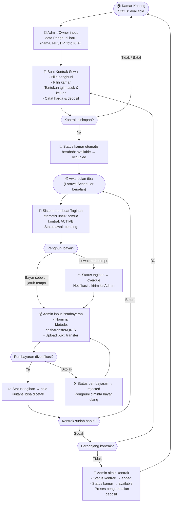

# TechDesign — Aplikasi Management Kost Pribadi

> Dokumen ini adalah referensi teknis utama. Dibaca oleh developer maupun
> non-programmer untuk memahami bagaimana sistem bekerja secara keseluruhan.

---

## 1. Entity Relationship Diagram (ERD)

Diagram berikut menunjukkan semua tabel dalam database beserta relasinya.
Garis penghubung berarti satu data di tabel A bisa berhubungan dengan
banyak data di tabel B (relasi "satu ke banyak").

```mermaid
erDiagram

    USERS {
        bigint      id              PK  "Auto increment"
        string      name            NN  "Nama lengkap"
        string      email           NN  "Unik"
        string      password        NN
        enum        role            NN  "owner | admin"
        timestamp   email_verified_at
        timestamp   created_at
        timestamp   updated_at
    }

    ROOMS {
        bigint      id              PK
        string      room_number     NN  "Unik, cth: 101"
        tinyint     floor           NN  "Lantai ke-berapa"
        enum        type            NN  "standard | deluxe | suite"
        decimal     size_m2             "Luas dalam meter persegi"
        decimal     monthly_price   NN  "Harga sewa per bulan"
        decimal     deposit_price   NN  "Besaran deposit"
        enum        status          NN  "available | occupied | maintenance"
        json        facilities          "Daftar fasilitas: AC, wifi, dll"
        timestamp   created_at
        timestamp   updated_at
    }

    ROOM_PHOTOS {
        bigint      id              PK
        bigint      room_id         FK
        string      file_path       NN  "Path file di storage"
        boolean     is_primary          "Foto utama yang ditampilkan"
        timestamp   created_at
    }

    TENANTS {
        bigint      id              PK
        string      name            NN  "Nama lengkap"
        string      nik             NN  "Unik, 16 digit KTP"
        string      phone           NN
        string      email
        enum        gender          NN  "male | female"
        date        birth_date
        text        address
        string      ktp_photo_path      "Path foto KTP di storage"
        string      tenant_photo_path   "Path foto penghuni"
        string      emergency_contact_name
        string      emergency_contact_phone
        timestamp   created_at
        timestamp   updated_at
    }

    CONTRACTS {
        bigint      id              PK
        bigint      tenant_id       FK
        bigint      room_id         FK
        date        start_date      NN  "Tanggal masuk"
        date        end_date        NN  "Tanggal keluar rencana"
        decimal     rent_price      NN  "Harga sewa saat kontrak (snapshot)"
        decimal     deposit_amount  NN  "Nominal deposit yang dibayar"
        enum        status          NN  "active | ended | terminated"
        text        notes
        bigint      created_by      FK  "ID user yang buat kontrak"
        timestamp   created_at
        timestamp   updated_at
    }

    INVOICES {
        bigint      id              PK
        bigint      contract_id     FK
        bigint      tenant_id       FK
        bigint      room_id         FK
        year        year            NN  "Tahun tagihan"
        tinyint     month           NN  "Bulan tagihan (1-12)"
        decimal     rent_amount     NN  "Komponen: biaya sewa"
        decimal     electricity_fee     "Komponen: biaya listrik"
        decimal     water_fee           "Komponen: biaya air"
        decimal     internet_fee        "Komponen: biaya internet"
        decimal     penalty_fee         "Komponen: denda keterlambatan"
        decimal     other_fee           "Komponen: biaya lain"
        decimal     total_amount    NN  "Total semua komponen"
        date        due_date        NN  "Tanggal jatuh tempo"
        enum        status          NN  "pending | paid | overdue | cancelled"
        timestamp   created_at
        timestamp   updated_at
    }

    PAYMENTS {
        bigint      id              PK
        bigint      invoice_id      FK
        bigint      tenant_id       FK
        decimal     amount          NN  "Nominal yang dibayar"
        date        payment_date    NN
        enum        method          NN  "cash | transfer | qris | other"
        enum        status          NN  "verified | pending | rejected"
        string      proof_path          "Path bukti transfer di storage"
        text        notes
        bigint      verified_by         "ID user yang verifikasi"
        timestamp   created_at
        timestamp   updated_at
    }

    EXPENSES {
        bigint      id              PK
        enum        category        NN  "electricity|water|internet|repair|cleaning|salary|other"
        string      description     NN  "Keterangan pengeluaran"
        decimal     amount          NN  "Nominal pengeluaran"
        date        expense_date    NN
        string      receipt_path        "Path struk/bukti pengeluaran"
        bigint      created_by      FK  "ID user yang input"
        timestamp   created_at
        timestamp   updated_at
    }

    NOTIFICATIONS {
        string      id              PK  "UUID"
        string      type            NN  "Nama class notifikasi"
        string      notifiable_type NN  "Biasanya: App\Models\User"
        bigint      notifiable_id   NN  "ID penerima"
        text        data            NN  "Isi notifikasi (JSON)"
        timestamp   read_at             "NULL = belum dibaca"
        timestamp   created_at
        timestamp   updated_at
    }

    ROOMS           ||--o{ ROOM_PHOTOS   : "punya banyak foto"
    ROOMS           ||--o{ CONTRACTS     : "punya banyak kontrak (riwayat)"
    TENANTS         ||--o{ CONTRACTS     : "punya banyak kontrak"
    CONTRACTS       ||--o{ INVOICES      : "menghasilkan banyak tagihan"
    INVOICES        ||--o{ PAYMENTS      : "bisa dibayar berkali-kali"
    TENANTS         ||--o{ INVOICES      : "tagihan milik penghuni"
    TENANTS         ||--o{ PAYMENTS      : "pembayaran oleh penghuni"
    USERS           ||--o{ EXPENSES      : "pengeluaran diinput user"
    USERS           ||--o{ CONTRACTS     : "kontrak dibuat oleh user"
    USERS           ||--o{ NOTIFICATIONS : "notifikasi dikirim ke user"
```

---

## 2. Database Schema (Skema Database)

Penjelasan detail setiap tabel: kolom apa saja, tipe datanya, wajib diisi
atau boleh kosong, dan index apa yang dipasang agar pencarian cepat.

---

### Tabel: `users`
*Menyimpan akun login Owner dan Admin.*

| Kolom | Tipe | Wajib | Index | Keterangan |
|---|---|---|---|---|
| `id` | BIGINT | ✓ | PK | Nomor unik otomatis |
| `name` | VARCHAR(255) | ✓ | — | Nama tampilan |
| `email` | VARCHAR(255) | ✓ | UNIQUE | Dipakai untuk login |
| `password` | VARCHAR(255) | ✓ | — | Disimpan terenkripsi (bcrypt) |
| `role` | ENUM | ✓ | INDEX | `owner` atau `admin` |
| `email_verified_at` | TIMESTAMP | — | — | Waktu verifikasi email |
| `remember_token` | VARCHAR(100) | — | — | Token "ingat saya" |
| `created_at` | TIMESTAMP | — | — | Otomatis diisi Laravel |
| `updated_at` | TIMESTAMP | — | — | Otomatis diisi Laravel |

---

### Tabel: `rooms`
*Menyimpan data semua kamar kost.*

| Kolom | Tipe | Wajib | Index | Keterangan |
|---|---|---|---|---|
| `id` | BIGINT | ✓ | PK | |
| `room_number` | VARCHAR(20) | ✓ | UNIQUE | Nomor kamar, mis: "101", "A2" |
| `floor` | TINYINT | ✓ | INDEX | Lantai (1, 2, 3, ...) |
| `type` | ENUM | ✓ | INDEX | `standard` / `deluxe` / `suite` |
| `size_m2` | DECIMAL(5,2) | — | — | Luas m2, mis: 12.50 |
| `monthly_price` | DECIMAL(12,2) | ✓ | — | Harga normal per bulan |
| `deposit_price` | DECIMAL(12,2) | ✓ | — | Besaran deposit standar |
| `status` | ENUM | ✓ | INDEX | `available` / `occupied` / `maintenance` |
| `facilities` | JSON | — | — | Misal: ["AC","WiFi","Kasur"] |
| `created_at` | TIMESTAMP | — | — | |
| `updated_at` | TIMESTAMP | — | — | |

---

### Tabel: `room_photos`
*Menyimpan foto-foto kamar (satu kamar bisa banyak foto).*

| Kolom | Tipe | Wajib | Index | Keterangan |
|---|---|---|---|---|
| `id` | BIGINT | ✓ | PK | |
| `room_id` | BIGINT | ✓ | FK + INDEX | Kamar mana |
| `file_path` | VARCHAR(500) | ✓ | — | Path file di server |
| `is_primary` | BOOLEAN | ✓ | — | Default false; hanya 1 foto utama |
| `created_at` | TIMESTAMP | — | — | |

---

### Tabel: `tenants`
*Menyimpan data diri setiap penghuni kost.*

| Kolom | Tipe | Wajib | Index | Keterangan |
|---|---|---|---|---|
| `id` | BIGINT | ✓ | PK | |
| `name` | VARCHAR(255) | ✓ | INDEX | |
| `nik` | VARCHAR(16) | ✓ | UNIQUE | Nomor KTP 16 digit |
| `phone` | VARCHAR(20) | ✓ | INDEX | |
| `email` | VARCHAR(255) | — | INDEX | |
| `gender` | ENUM | ✓ | — | `male` / `female` |
| `birth_date` | DATE | — | — | |
| `address` | TEXT | — | — | Alamat asal |
| `ktp_photo_path` | VARCHAR(500) | — | — | Foto KTP |
| `tenant_photo_path` | VARCHAR(500) | — | — | Foto wajah penghuni |
| `emergency_contact_name` | VARCHAR(255) | — | — | Nama kontak darurat |
| `emergency_contact_phone` | VARCHAR(20) | — | — | HP kontak darurat |
| `created_at` | TIMESTAMP | — | — | |
| `updated_at` | TIMESTAMP | — | — | |

---

### Tabel: `contracts`
*Menyimpan perjanjian sewa antara penghuni dan kamar.*

| Kolom | Tipe | Wajib | Index | Keterangan |
|---|---|---|---|---|
| `id` | BIGINT | ✓ | PK | |
| `tenant_id` | BIGINT | ✓ | FK + INDEX | Penghuni siapa |
| `room_id` | BIGINT | ✓ | FK + INDEX | Kamar mana |
| `start_date` | DATE | ✓ | INDEX | Tanggal masuk |
| `end_date` | DATE | ✓ | INDEX | Tanggal keluar rencana |
| `rent_price` | DECIMAL(12,2) | ✓ | — | Harga sewa yg disepakati (snapshot) |
| `deposit_amount` | DECIMAL(12,2) | ✓ | — | Deposit yang dibayar |
| `status` | ENUM | ✓ | INDEX | `active` / `ended` / `terminated` |
| `notes` | TEXT | — | — | Catatan tambahan |
| `created_by` | BIGINT | ✓ | FK | User yang membuat kontrak |
| `created_at` | TIMESTAMP | — | — | |
| `updated_at` | TIMESTAMP | — | — | |

> **Catatan penting:** Kolom `rent_price` menyimpan harga **saat kontrak dibuat**
> (snapshot), bukan mengambil dari tabel `rooms`. Ini memastikan riwayat
> harga tidak berubah meski harga kamar naik di kemudian hari.
>
> **Unique constraint:** Kombinasi `(tenant_id, room_id, start_date)` harus unik.

---

### Tabel: `invoices`
*Tagihan bulanan yang dibuat otomatis tiap awal bulan.*

| Kolom | Tipe | Wajib | Index | Keterangan |
|---|---|---|---|---|
| `id` | BIGINT | ✓ | PK | |
| `contract_id` | BIGINT | ✓ | FK + INDEX | Dari kontrak mana |
| `tenant_id` | BIGINT | ✓ | FK + INDEX | Penghuni siapa (denormalized) |
| `room_id` | BIGINT | ✓ | FK + INDEX | Kamar mana (denormalized) |
| `year` | YEAR | ✓ | — | Tahun tagihan |
| `month` | TINYINT | ✓ | — | Bulan tagihan (1-12) |
| `rent_amount` | DECIMAL(12,2) | ✓ | — | Komponen sewa |
| `electricity_fee` | DECIMAL(10,2) | — | — | Komponen listrik |
| `water_fee` | DECIMAL(10,2) | — | — | Komponen air |
| `internet_fee` | DECIMAL(10,2) | — | — | Komponen internet |
| `penalty_fee` | DECIMAL(10,2) | — | — | Komponen denda |
| `other_fee` | DECIMAL(10,2) | — | — | Komponen lain-lain |
| `total_amount` | DECIMAL(12,2) | ✓ | — | Total semua komponen |
| `due_date` | DATE | ✓ | INDEX | Jatuh tempo pembayaran |
| `status` | ENUM | ✓ | INDEX | `pending` / `paid` / `overdue` / `cancelled` |
| `created_at` | TIMESTAMP | — | — | |
| `updated_at` | TIMESTAMP | — | — | |

> **Unique constraint:** Kombinasi `(contract_id, year, month)` harus unik —
> tidak boleh ada tagihan dobel untuk bulan yang sama.

---

### Tabel: `payments`
*Pencatatan setiap pembayaran atas tagihan.*

| Kolom | Tipe | Wajib | Index | Keterangan |
|---|---|---|---|---|
| `id` | BIGINT | ✓ | PK | |
| `invoice_id` | BIGINT | ✓ | FK + INDEX | Tagihan mana yang dibayar |
| `tenant_id` | BIGINT | ✓ | FK + INDEX | Denormalized untuk query riwayat |
| `amount` | DECIMAL(12,2) | ✓ | — | Nominal yang dibayar |
| `payment_date` | DATE | ✓ | INDEX | Tanggal bayar |
| `method` | ENUM | ✓ | — | `cash` / `transfer` / `qris` / `other` |
| `status` | ENUM | ✓ | INDEX | `pending` / `verified` / `rejected` |
| `proof_path` | VARCHAR(500) | — | — | Bukti transfer (opsional untuk cash) |
| `notes` | TEXT | — | — | Catatan |
| `verified_by` | BIGINT | — | FK | User yang memverifikasi |
| `created_at` | TIMESTAMP | — | — | |
| `updated_at` | TIMESTAMP | — | — | |

---

### Tabel: `expenses`
*Pencatatan pengeluaran operasional kost.*

| Kolom | Tipe | Wajib | Index | Keterangan |
|---|---|---|---|---|
| `id` | BIGINT | ✓ | PK | |
| `category` | ENUM | ✓ | INDEX | Kategori pengeluaran |
| `description` | VARCHAR(500) | ✓ | — | Keterangan detail |
| `amount` | DECIMAL(12,2) | ✓ | — | Nominal |
| `expense_date` | DATE | ✓ | INDEX | Tanggal pengeluaran |
| `receipt_path` | VARCHAR(500) | — | — | Foto struk/bukti |
| `created_by` | BIGINT | ✓ | FK | User yang input |
| `created_at` | TIMESTAMP | — | — | |
| `updated_at` | TIMESTAMP | — | — | |

> **Kategori ENUM:** `electricity` / `water` / `internet` / `repair` /
> `cleaning` / `salary` / `other`

---

### Tabel: `notifications`
*Notifikasi dalam aplikasi — menggunakan standar Laravel Notification.*

| Kolom | Tipe | Wajib | Index | Keterangan |
|---|---|---|---|---|
| `id` | VARCHAR(36) | ✓ | PK | UUID, bukan auto-increment |
| `type` | VARCHAR(255) | ✓ | — | Nama class notifikasi |
| `notifiable_type` | VARCHAR(255) | ✓ | INDEX | Biasanya "App\Models\User" |
| `notifiable_id` | BIGINT | ✓ | INDEX | ID penerima |
| `data` | TEXT | ✓ | — | Isi notifikasi (JSON) |
| `read_at` | TIMESTAMP | — | — | NULL = belum dibaca |
| `created_at` | TIMESTAMP | — | — | |
| `updated_at` | TIMESTAMP | — | — | |

> Tabel ini dibuat otomatis oleh Laravel, tidak perlu dibuat manual.

---

## 3. Use Case Diagram

Diagram teks berikut menggambarkan **siapa bisa melakukan apa** dalam sistem.

```
+==============================================================+
|                  APLIKASI MANAGEMENT KOST                    |
+==============================================================+
|                                                              |
|  +---------+     +-------------------------------------+    |
|  |         |     |  MODUL KAMAR                        |    |
|  |  OWNER  |---->|  - Lihat daftar kamar               |    |
|  |         |     |  - Tambah / Edit / Hapus kamar      |    |
|  |  &      |     |  - Upload foto kamar                 |    |
|  |         |     |  - Filter & cari kamar               |    |
|  |  ADMIN  |     +-------------------------------------+    |
|  |         |                                                  |
|  +----+----+     +-------------------------------------+    |
|       |          |  MODUL PENGHUNI                      |    |
|       +--------->|  - Lihat daftar penghuni             |    |
|       |          |  - Tambah / Edit / Hapus penghuni    |    |
|       |          |  - Upload foto KTP & penghuni        |    |
|       |          |  - Lihat riwayat sewa penghuni       |    |
|       |          +-------------------------------------+    |
|       |                                                       |
|       |          +-------------------------------------+    |
|       |          |  MODUL KONTRAK                       |    |
|       +--------->|  - Buat kontrak baru                 |    |
|       |          |  - Perpanjang kontrak                 |    |
|       |          |  - Akhiri kontrak                    |    |
|       |          |  - Lihat riwayat kontrak             |    |
|       |          +-------------------------------------+    |
|       |                                                       |
|       |          +-------------------------------------+    |
|       |          |  MODUL TAGIHAN                       |    |
|       +--------->|  - Lihat tagihan per penghuni        |    |
|       |          |  - Buat tagihan manual (jika perlu)  |    |
|       |          |  - Edit komponen tagihan             |    |
|       |          |  [SISTEM] Buat tagihan otomatis      |    |
|       |          |           setiap awal bulan          |    |
|       |          +-------------------------------------+    |
|       |                                                       |
|       |          +-------------------------------------+    |
|       |          |  MODUL PEMBAYARAN                    |    |
|       +--------->|  - Input pembayaran baru             |    |
|       |          |  - Upload bukti transfer             |    |
|       |          |  - Verifikasi pembayaran             |    |
|       |          |  - Cetak kuitansi                    |    |
|       |          |  - Lihat riwayat pembayaran          |    |
|       |          +-------------------------------------+    |
|       |                                                       |
|       |          +-------------------------------------+    |
|       |          |  MODUL PENGELUARAN                   |    |
|       +--------->|  - Input / Edit / Hapus pengeluaran  |    |
|       |          |  - Upload struk/bukti                |    |
|       |          |  - Filter per kategori & periode     |    |
|       |          +-------------------------------------+    |
|       |                                                       |
|       |          +-------------------------------------+    |
|       |          |  MODUL NOTIFIKASI                    |    |
|       +--------->|  - Lihat notifikasi masuk            |    |
|       |          |  - Tandai sudah dibaca               |    |
|       |          +-------------------------------------+    |
|       |                                                       |
|       |          +-------------------------------------+    |
|       |          |  DASHBOARD                           |    |
|       +--------->|  - Lihat ringkasan statistik         |    |
|                  |  - Lihat chart pendapatan & occupancy|    |
|                  +-------------------------------------+    |
|                                                              |
|  +---------+     +-------------------------------------+    |
|  |         |     |  MODUL LAPORAN (Owner Only)          |    |
|  |  OWNER  |---->|  - Laporan pendapatan & pengeluaran  |    |
|  |  ONLY   |     |  - Laporan laba rugi                 |    |
|  |         |     |  - Laporan occupancy rate            |    |
|  +---------+     |  - Laporan piutang                   |    |
|                  |  - Export PDF / Excel / CSV          |    |
|                  +-------------------------------------+    |
+==============================================================+

Keterangan:
  [SISTEM]   = dilakukan otomatis oleh aplikasi (scheduler), bukan manusia
  OWNER ONLY = hanya Owner yang bisa mengakses modul laporan keuangan
               (detail permission ditentukan saat implementasi Authorization)
```

---

## 4. Flow Sistem Utama

Bagian ini menjelaskan perjalanan lengkap data dalam sistem, dari kamar kosong
hingga pembayaran berhasil, dalam bahasa yang mudah dipahami.

---

### 4.1 Alur Lengkap: Kamar Kosong → Penghuni → Kontrak → Tagihan → Pembayaran



---

### 4.2 Alur Detail: Pembuatan Tagihan Otomatis

Setiap **tanggal 1** setiap bulan, sistem menjalankan proses berikut secara otomatis:

```
Scheduler berjalan (tgl 1, jam 07:00)
        |
        v
Ambil semua kontrak dengan status = 'active'
        |
        v
Untuk setiap kontrak aktif:
    |-- Cek: apakah tagihan bulan ini sudah ada?
    |       |-- Sudah ada  --> lewati (skip)
    |       +-- Belum ada  --> buat tagihan baru
    |
    |-- Isi komponen tagihan:
    |       |-- rent_amount     = ambil dari contracts.rent_price
    |       |-- electricity_fee = diisi manual setelah tagihan dibuat
    |       |-- water_fee       = diisi manual setelah tagihan dibuat
    |       |-- internet_fee    = tetap (jika ada)
    |       +-- total_amount    = jumlah semua komponen
    |
    |-- Set due_date = tanggal 10 bulan berjalan (bisa dikonfigurasi)
    |-- Set status   = 'pending'
    |
    +-- Kirim notifikasi ke Admin/Owner: "Tagihan bulan X sudah dibuat"
```

---

### 4.3 Alur Notifikasi

Sistem mengirim notifikasi secara otomatis pada kondisi berikut:

| Kondisi | Kapan Dikirim | Penerima |
|---|---|---|
| Tagihan baru dibuat | Setiap awal bulan (scheduler) | Admin + Owner |
| Tagihan hampir jatuh tempo | H-3 sebelum due_date | Admin + Owner |
| Tagihan overdue | Saat due_date terlewati | Admin + Owner |
| Kontrak hampir habis | H-14 sebelum end_date | Admin + Owner |
| Pembayaran baru masuk | Saat pembayaran diinput | Owner (untuk verifikasi) |
| Pembayaran terverifikasi | Saat diverifikasi | Admin yang input |

---

### 4.4 Ringkasan Status dan Transisi

#### Status Kamar (`rooms.status`)
```
available   --[kontrak dibuat]--> occupied
occupied    --[kontrak selesai]--> available
available   --[masuk perbaikan]--> maintenance
maintenance --[perbaikan selesai]--> available
```

#### Status Kontrak (`contracts.status`)
```
active --[kontrak habis/diperpanjang]--> ended
active --[diakhiri paksa]-------------> terminated
```

#### Status Tagihan (`invoices.status`)
```
pending --[terlewat due_date]------> overdue
pending --[pembayaran verified]----> paid
overdue --[pembayaran verified]----> paid
pending --[dibatalkan admin]-------> cancelled
```

#### Status Pembayaran (`payments.status`)
```
pending  --[diverifikasi]---> verified
pending  --[ditolak]-------> rejected
rejected --[bayar ulang]---> pending (record baru dibuat)
```

---

*Dokumen ini dibuat sebagai bagian dari analisis Tahap 1.*
*Implementasi teknis (kode, migration, dll) ada di tahap selanjutnya.*
