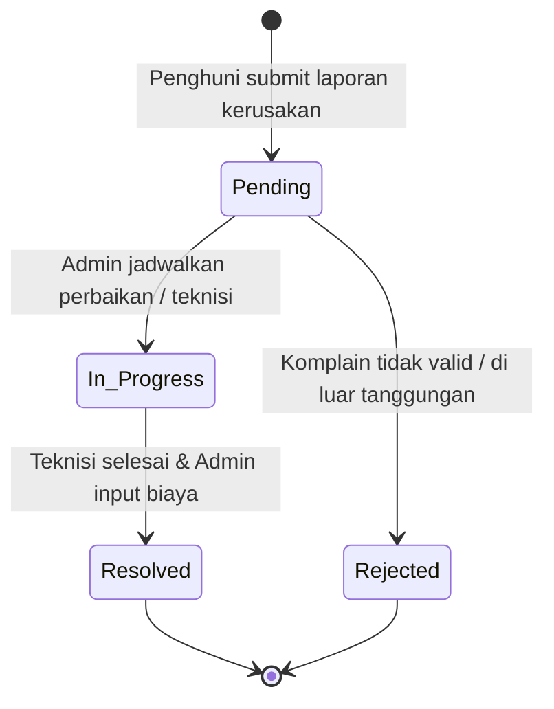
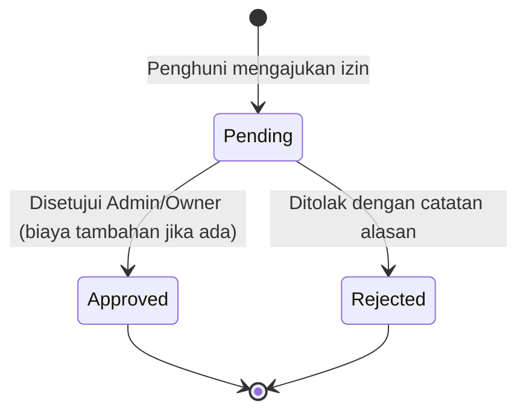
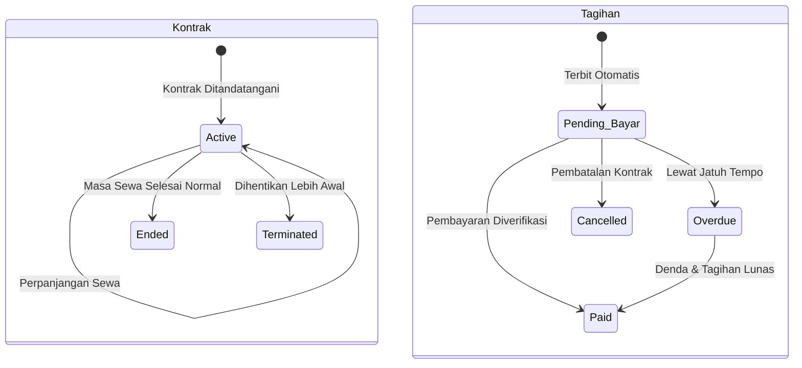

# TechDesign — Aplikasi Management Kost Pribadi (Seulanga)

> Dokumen ini adalah referensi teknis dan arsitektur utama untuk sistem Management Kost (Seulanga).
> Berisi rancangan skema database, arsitektur 4 pilar produk, use case, alur bisnis (*state machines*), dan matriks otorisasi.

---

## 1. Arsitektur 4 Pilar Produk

Sistem dibagi menjadi 4 pilar fungsional yang saling terhubung:

```
┌─────────────────────────────────────────────────────────────────────────────────────────┐
│                                    SEULANGA PLATFORM                                    │
├──────────────────────────┬──────────────────────────┬───────────────────────────────────┤
│ 1. OPERATIONAL CORE      │ 2. TENANT PORTAL         │ 3. MANAGEMENT & DECISION SUPPORT │
│ (Admin & Owner)          │ (Penghuni / Tenant)      │ (Owner / Executive)               │
├──────────────────────────┼──────────────────────────┼───────────────────────────────────┤
│ • Manajemen Kamar        │ • Profil & Ganti Sandi   │ • Dashboard Eksekutif KPI         │
│ • Data Penghuni & NIK    │ • Kamar Saya & Fasilitas │ • Analisis BEP (Break-Even Point) │
│ • Kontrak Sewa & Deposit │ • Kontrak & Riwayat Sewa │ • Analisis Okupansi & Retensi     │
│ • Tagihan (Invoices)     │ • Tagihan & Riwayat Bayar│ • Manajemen & Aging Piutang       │
│ • Pembayaran & Verifikasi│ • Upload Bukti Bayar     │ • Analisis Cash Flow & Proyeksi   │
│ • Pengeluaran & Kategori │ • Arsip Dokumen Perjanjian│ • Expense Breakdown & Anomali    │
│ • Pengaturan & Rekening  │ • Laporan Kerusakan      │ • Maintenance Cost Analysis       │
│                          │ • Pengajuan Perizinan    │ • Laporan Laba Rugi Komprehensif  │
├──────────────────────────┴──────────────────────────┴───────────────────────────────────┤
│                                4. COMMUNICATION ENGINE                                  │
│  • In-App Notifications (Web Realtime)   • Email Transactional & Invoice PDF            │
│  • WhatsApp Automated Gateway (API)      • Payment & Contract Due Reminders             │
│  • Maintenance Updates & Ticket Status   • Request Approval Workflows                   │
└─────────────────────────────────────────────────────────────────────────────────────────┘
```

---

## 2. Entity Relationship Diagram (ERD)

```mermaid
erDiagram

    USERS {
        bigint      id              PK  "Auto increment"
        string      name            NN  "Nama lengkap"
        string      email           NN  "Unik, untuk login"
        string      password        NN  "Hashed"
        enum        role            NN  "owner | admin | tenant"
        timestamp   email_verified_at
        timestamp   created_at
        timestamp   updated_at
    }

    ROOM_TYPES {
        bigint      id              PK
        string      name            NN  "Unik, cth: Deluxe, Standard"
        text        description
        decimal     default_price
        timestamp   created_at
        timestamp   updated_at
    }

    FACILITIES {
        bigint      id              PK
        string      name            NN  "Unik, cth: AC, WiFi, Water Heater"
        string      icon
        timestamp   created_at
        timestamp   updated_at
    }

    ROOM_FACILITIES {
        bigint      room_id         PK,FK
        bigint      facility_id     PK,FK
    }

    ROOMS {
        bigint      id              PK
        string      room_number     NN  "Unik, cth: 101, A2"
        tinyint     floor           NN  "Lantai"
        bigint      room_type_id    FK
        decimal     size_m2
        decimal     monthly_price   NN
        decimal     deposit_price   NN
        enum        status          NN  "available | occupied | maintenance"
        timestamp   created_at
        timestamp   updated_at
    }

    ROOM_PHOTOS {
        bigint      id              PK
        bigint      room_id         FK
        string      file_path       NN
        boolean     is_primary
        timestamp   created_at
    }

    TENANTS {
        bigint      id              PK
        bigint      user_id         FK  "Relasi akun login (Nullable/Unique)"
        string      name            NN
        string      nik             NN  "Unik, 16 digit"
        string      phone           NN
        string      email
        enum        gender          NN  "male | female"
        date        birth_date
        text        address
        string      ktp_photo_path
        string      tenant_photo_path
        string      emergency_contact_name
        string      emergency_contact_phone
        timestamp   created_at
        timestamp   updated_at
    }

    CONTRACTS {
        bigint      id              PK
        bigint      tenant_id       FK
        bigint      room_id         FK
        date        start_date      NN
        date        end_date        NN
        decimal     rent_price      NN
        decimal     deposit_amount  NN
        enum        status          NN  "active | ended | terminated"
        text        notes
        bigint      created_by      FK
        timestamp   created_at
        timestamp   updated_at
    }

    INVOICES {
        bigint      id              PK
        bigint      contract_id     FK
        bigint      tenant_id       FK
        bigint      room_id         FK
        year        year            NN
        tinyint     month           NN
        decimal     rent_amount     NN
        decimal     electricity_fee
        decimal     water_fee
        decimal     internet_fee
        decimal     penalty_fee
        decimal     other_fee
        decimal     total_amount    NN
        date        due_date        NN
        enum        status          NN  "pending | paid | overdue | cancelled"
        timestamp   created_at
        timestamp   updated_at
    }

    PAYMENT_METHODS {
        bigint      id              PK
        string      name            NN  "Cash, Transfer Bank, QRIS"
        timestamp   created_at
        timestamp   updated_at
    }

    PAYMENTS {
        bigint      id              PK
        bigint      invoice_id      FK
        bigint      tenant_id       FK
        decimal     amount          NN
        date        payment_date    NN
        bigint      payment_method_id FK
        enum        status          NN  "verified | pending | rejected"
        string      proof_path
        text        notes
        bigint      verified_by     FK
        timestamp   created_at
        timestamp   updated_at
    }

    EXPENSE_CATEGORIES {
        bigint      id              PK
        string      name            NN
        timestamp   created_at
        timestamp   updated_at
    }

    EXPENSES {
        bigint      id              PK
        bigint      expense_category_id FK
        string      description     NN
        decimal     amount          NN
        date        expense_date    NN
        string      receipt_path
        bigint      created_by      FK
        timestamp   created_at
        timestamp   updated_at
    }

    MAINTENANCE_REQUESTS {
        bigint      id              PK
        bigint      tenant_id       FK
        bigint      room_id         FK
        string      title           NN
        text        description     NN
        string      photo_path
        enum        priority        NN  "low | medium | high | urgent"
        enum        status          NN  "pending | in_progress | resolved | rejected"
        decimal     cost_incurred       "Biaya perbaikan jika ada"
        text        resolution_notes
        bigint      resolved_by     FK
        timestamp   resolved_at
        timestamp   created_at
        timestamp   updated_at
    }

    TENANT_PERMISSIONS {
        bigint      id              PK
        bigint      tenant_id       FK
        enum        type            NN  "guest_stay | electronic_device | late_return | other"
        date        start_date      NN
        date        end_date
        text        description     NN
        enum        status          NN  "pending | approved | rejected"
        text        admin_notes
        bigint      approved_by     FK
        timestamp   approved_at
        timestamp   created_at
        timestamp   updated_at
    }

    BANK_ACCOUNTS {
        bigint      id              PK
        string      nama_bank       NN
        string      nomor_rekening  NN
        string      nama_pemilik_rekening NN
        boolean     is_active       NN
        timestamp   created_at
        timestamp   updated_at
    }

    ADDITIONAL_FEE_TYPES {
        bigint      id              PK
        string      nama            NN
        enum        jenis           NN  "nominal_tetap | persentase"
        decimal     nilai_default   NN
        boolean     is_active       NN
        timestamp   created_at
        timestamp   updated_at
    }

    SETTINGS {
        bigint      id              PK
        string      kost_name       NN
        string      kost_logo
        text        kost_address
        string      kost_phone
        integer     default_due_date_day NN
        decimal     property_investment_cost "Modal investasi awal untuk analisis BEP"
        decimal     monthly_fixed_overhead   "Biaya tetap bulanan (operasional dasar)"
        bigint      default_late_fee_id FK
        bigint      default_bank_account_id FK
        timestamp   created_at
        timestamp   updated_at
    }

    NOTIFICATIONS {
        string      id              PK  "UUID"
        string      type            NN
        string      notifiable_type NN
        bigint      notifiable_id   NN
        text        data            NN  "JSON"
        timestamp   read_at
        timestamp   created_at
        timestamp   updated_at
    }

    COMMUNICATION_LOGS {
        bigint      id              PK
        bigint      tenant_id       FK
        enum        channel         NN  "in_app | whatsapp | email"
        string      recipient       NN  "Nomor WA / Alamat Email"
        string      event_type      NN  "payment_reminder | contract_reminder | ticket_update"
        text        message_payload NN
        enum        status          NN  "pending | sent | delivered | failed"
        text        error_message
        timestamp   sent_at
        timestamp   created_at
    }

    ROOM_TYPES           ||--o{ ROOMS                : "memiliki banyak"
    ROOMS                ||--o{ ROOM_FACILITIES        : "punya fasilitas"
    FACILITIES           ||--o{ ROOM_FACILITIES        : "dimiliki kamar"
    ROOMS                ||--o{ ROOM_PHOTOS          : "punya foto"
    ROOMS                ||--o{ CONTRACTS            : "riwayat kontrak"
    TENANTS              ||--o{ CONTRACTS            : "punya kontrak"
    CONTRACTS            ||--o{ INVOICES             : "menghasilkan tagihan"
    INVOICES             ||--o{ PAYMENTS             : "dicicil/dibayar"
    PAYMENT_METHODS      ||--o{ PAYMENTS             : "metode bayar"
    EXPENSE_CATEGORIES   ||--o{ EXPENSES             : "kategori"
    TENANTS              ||--o{ INVOICES             : "tagihan milik"
    TENANTS              ||--o{ PAYMENTS             : "pembayaran oleh"
    TENANTS              ||--o{ MAINTENANCE_REQUESTS : "lapor kerusakan"
    TENANTS              ||--o{ TENANT_PERMISSIONS   : "mengajukan izin"
    TENANTS              ||--o{ COMMUNICATION_LOGS   : "riwayat pesan"
    USERS                ||--o| TENANTS              : "akun portal penghuni"
    USERS                ||--o{ EXPENSES             : "diinput oleh"
    USERS                ||--o{ CONTRACTS            : "dibuat oleh"
    USERS                ||--o{ NOTIFICATIONS        : "notifikasi"
```

---

## 3. Rincian Modul Berdasarkan 4 Pilar Produk

### 3.1 Pilar 1: Operational Core *(Sudah Selesai & Stabil)*

| Modul | Controller Utama | Deskripsi & Fitur Kunci |
|---|---|---|
| **Kamar & Fasilitas** | `RoomController`, `RoomTypeController`, `FacilityController` | Monitoring ketersediaan kamar, galeri foto kamar, penetapan tarif sewa & deposit dasar. |
| **Penghuni** | `TenantController` | Database penghuni aktif & arsip, NIK 16 digit, kontak darurat, foto profil & KTP. |
| **Kontrak Sewa** | `ContractController` | Pembuatan kontrak, *price lock*, perpanjangan kontrak, penghentian & pengembalian kamar ke status *available*. |
| **Tagihan** | `InvoiceController`, `GenerateMonthlyInvoices` (Schedule) | Otomatisasi generate tagihan tanggal 1, kalkulasi denda, penyesuaian biaya listrik/air. |
| **Pembayaran** | `PaymentController` | Pencatatan transaksi multi-channel, verifikasi/penolakan bukti transfer, generate kuitansi. |
| **Pengeluaran** | `ExpenseController`, `ExpenseCategoryController` | Pencatatan biaya operasional, upload bukti nota/struk, pengelompokan kategori. |

---

### 3.2 Pilar 2: Tenant Portal *(Next Development Phase)*

Portal mandiri berbasis web (*mobile-first*) khusus bagi penghuni:

```
Tenant Login (/portal/login)
  │
  ├── 🏠 Kamar Saya (/portal/my-room)
  │     └── Detail spesifikasi kamar, daftar fasilitas aktif, aturan kost.
  │
  ├── 📜 Kontrak Saya (/portal/my-contract)
  │     └── Periode sewa, sisa masa tinggal, riwayat perpanjangan sewa.
  │
  ├── 💳 Tagihan & Pembayaran (/portal/my-invoices)
  │     ├── Daftar tagihan (Pending, Paid, Overdue)
  │     ├── Instruksi transfer bank & QRIS kost
  │     └── Form unggah bukti bayar mandiri + download kuitansi resmi
  │
  ├── 🛠️ Laporan Kerusakan (/portal/maintenance)
  │     ├── Buat tiket komplain/kerusakan + foto bukti
  │     └── Tracking status perbaikan: Pending ➔ In Progress ➔ Resolved
  │
  ├── 📝 Pengajuan Izin (/portal/permissions)
  │     ├── Izin bawa tamu menginap
  │     ├── Izin bawa barang elektronik bertarif
  │     └── Tracking approval dari Admin/Owner
  │
  └── 📂 Arsip Dokumen (/portal/documents)
        └── Unduh Surat Perjanjian Sewa Digital & Tata Tertib
```

---

### 3.3 Pilar 3: Management & Decision Support *(Executive / Owner Suite)*

Modul analisis tingkat lanjut untuk evaluasi profitabilitas dan performa bisnis properti:

```
Owner / Executive Area (/analytics)
  │
  ├── 📊 Dashboard Eksekutif
  │     └── KPI omset, margin laba bersih, tingkat keterisian harian, health index.
  │
  ├── 🎯 Analisis BEP (Break-Even Point)
  │     ├── Formula: Biaya Tetap Bulanan / (Harga Sewa Rata-rata - Biaya Variabel per Kamar)
  │     ├── Kamar Minimum Terisi untuk Impas Operasional
  │     └── Estimasi Payback Period Investasi Pokok Properti
  │
  ├── 📈 Analisis Okupansi & Churn Rate
  │     ├── Tren persentase keterisian per bulan
  │     └── Rata-rata Customer Lifetime Value (LTV) & masa tinggal penghuni
  │
  ├── ⏳ Aging Schedule Piutang (Accounts Receivable)
  │     ├── Klasifikasi tunggakan: Lancar (0-7 hari), Hati-hati (8-30 hari), Macet (>30 hari)
  │     └── Daftar penghuni dengan skor risiko tunggakan tertinggi
  │
  ├── 💵 Proyeksi & Arus Kas (Cash Flow Forecast)
  │     ├── Perbandingan arus kas masuk riil vs potensi piutang
  │     └── Proyeksi pendapatan 3 bulan ke depan berbasis kontrak aktif
  │
  └── 🔧 Maintenance Cost & Asset Evaluation
        ├── Rekapitulasi pengeluaran perbaikan per unit kamar
        └── Deteksi kamar/fasilitas dengan biaya perawatan paling boros
```

---

### 3.4 Pilar 4: Communication Engine *(Otomasi & Multi-Channel)*

Mesin pengiriman pesan dan notifikasi berbasis event (*event-driven*):

| Jenis Notifikasi | Saluran (Channel) | Pemicu (Trigger) | Target Penerima |
|---|---|---|---|
| **Tagihan Terbit** | In-App + WA + Email | Tagihan baru di-generate (awal bulan) | Tenant |
| **Payment Reminder (H-3 & H-0)** | WA Gateway | Menjelang jatuh tempo | Tenant |
| **Tagihan Overdue & Denda** | WA + In-App | Melewati tanggal due date | Tenant & Admin |
| **Konfirmasi Pembayaran Masuk** | In-App + Push | Tenant upload bukti bayar | Owner / Admin |
| **Kuitansi Lunas** | WA (PDF Link) + Email | Pembayaran diverifikasi | Tenant |
| **Contract Expiration (H-30 & H-14)** | WA + In-App | Menjelang akhir kontrak | Tenant & Admin |
| **Maintenance Ticket Update** | In-App + WA | Status tiket diubah Admin | Tenant Pelapor |
| **Permohonan Izin / Perpanjangan** | In-App | Tenant submit permohonan | Admin / Owner |

---

## 4. Alur Bisnis & State Machines

### 4.1 Siklus Hidup Tiket Kerusakan (`maintenance_requests`)


```mermaid
stateDiagram-v2
    [*] --> Pending: Penghuni submit laporan kerusakan
    Pending --> In_Progress: Admin jadwalkan perbaikan / teknisi
    Pending --> Rejected: Komplain tidak valid / di luar tanggungan
    In_Progress --> Resolved: Teknisi selesai & Admin input biaya
    Resolved --> [*]
    Rejected --> [*]
```

### 4.2 Siklus Hidup Permohonan Izin (`tenant_permissions`)


```mermaid
stateDiagram-v2
    [*] --> Pending: Penghuni mengajukan izin
    Pending --> Approved: Disetujui Admin/Owner (biaya tambahan jika ada)
    Pending --> Rejected: Ditolak dengan catatan alasan
    Approved --> [*]
    Rejected --> [*]
```

### 4.3 Siklus Hidup Kontrak & Tagihan


```mermaid
stateDiagram-v2
    state Kontrak {
        [*] --> Active: Kontrak Ditandatangani
        Active --> Active: Perpanjangan Sewa
        Active --> Ended: Masa Sewa Selesai Normal
        Active --> Terminated: Dihentikan Lebih Awal
    }

    state Tagihan {
        [*] --> Pending_Bayar: Terbit Otomatis
        Pending_Bayar --> Overdue: Lewat Jatuh Tempo
        Pending_Bayar --> Paid: Pembayaran Diverifikasi
        Overdue --> Paid: Denda & Tagihan Lunas
        Pending_Bayar --> Cancelled: Pembatalan Kontrak
    }
```

---

## 5. Matriks Hak Akses & Keamanan (RBAC)

| Modul / Fitur | Owner | Admin | Tenant |
|---|:---:|:---:|:---:|
| **Dashboard Eksekutif & BEP** | ✅ Penuh | ❌ | ❌ |
| **Laporan Keuangan Komprehensif** | ✅ Penuh | ❌ | ❌ |
| **Aging Piutang & Cash Flow** | ✅ Penuh | ❌ | ❌ |
| **Manajemen Kamar & Tipe Kamar** | ✅ Penuh | ✅ Penuh | ❌ |
| **Data Penghuni & Kontrak** | ✅ Penuh | ✅ Penuh | ❌ |
| **Input & Verifikasi Pembayaran** | ✅ Penuh | ✅ Penuh | ❌ |
| **Generate & Kelola Tagihan** | ✅ Penuh | ✅ Penuh | ❌ |
| **Pengeluaran Operasional** | ✅ Penuh | ✅ Penuh | ❌ |
| **Penyelesaian Tiket Maintenance** | ✅ Penuh | ✅ Penuh | ❌ |
| **Approval Izin Penghuni** | ✅ Penuh | ✅ Penuh | ❌ |
| **Tenant Portal (Kamar/Tagihan Saya)** | ❌ (Bypass view) | ❌ (Bypass view) | ✅ Milik Sendiri |
| **Submit Laporan Kerusakan & Izin** | ❌ | ❌ | ✅ Milik Sendiri |
| **Upload Bukti Bayar Mandiri** | ❌ | ❌ | ✅ Milik Sendiri |
| **Pengaturan Kost & Bank** | ✅ Penuh | ❌ | ❌ |
| **Manajemen User (Staff/Admin)** | ✅ Penuh | ❌ | ❌ |

---

## 6. Rencana Implementasi Bertahap

```
[FASE 1: OPERATIONAL CORE] ── Selesai 100% (147 Tests Passed)
    │
    ▼
[FASE 2: TENANT PORTAL]
    ├── Migrasi User Tenant & Relasi Model Tenant <-> User
    ├── Layout & UI Khusus Tenant Portal (PWA / Mobile Responsive)
    ├── Fitur Kamar Saya, Kontrak Saya, Tagihan & Pembayaran Mandiri
    ├── Fitur Tiket Laporan Kerusakan & Modul Approval Izin
    └── Pengujian Fitur & Policy Tenant
    │
    ▼
[FASE 3: COMMUNICATION ENGINE]
    ├── Service Integrasi WhatsApp Gateway (Fonnte / Wablas API)
    ├── Notification Class (Mail, Database, WhatsApp Channel)
    ├── Command & Scheduler Reminder H-3, H-0, H+3, Kontrak H-14
    └── Log & Monitoring Pengiriman Pesan
    │
    ▼
[FASE 4: MANAGEMENT & DECISION SUPPORT]
    ├── Rumus Kalkulasi BEP & Dynamic Payback Period
    ├── Laporan Aging Piutang & Skor Risiko Tunggakan
    ├── Evaluasi Biaya Maintenance per Kamar
    └── Dashboard Visualisasi Eksekutif (Chart.js Deep Insights)
```
